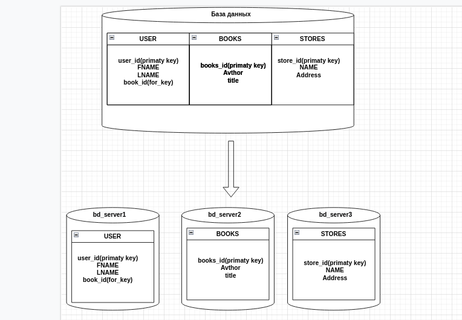
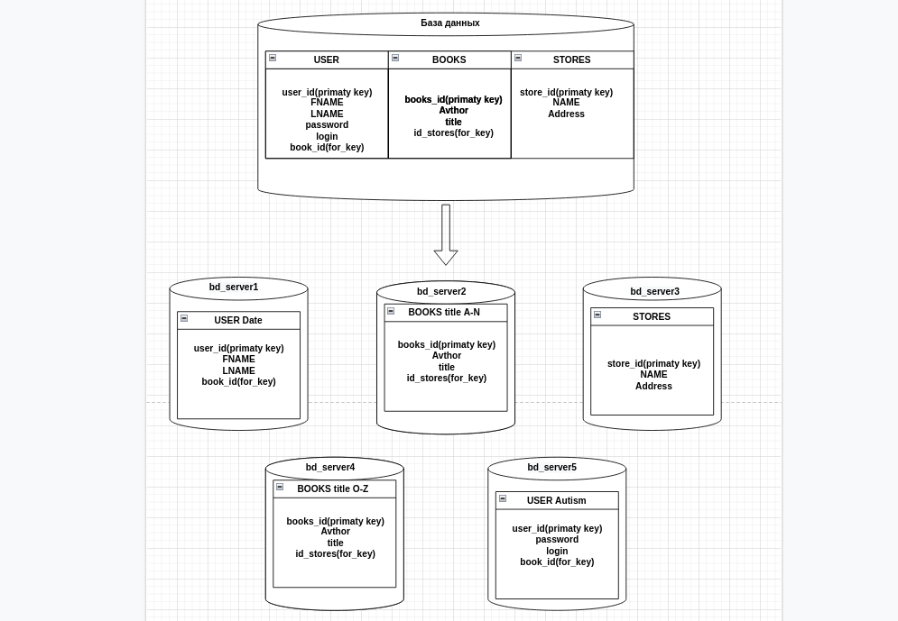

# Домашнее задание к занятию 12.7 "Репликация и масштабирование. Часть 2" - `Горбачев Олег`

Любые вопросы по решению задач задавайте в чате учебной группы.

### Задание 1.
Опишите основные преимущества использования масштабирования методами:

активный master-сервер и пассивный репликационный slave-сервер,
master-сервер и несколько slave-серверов,
активный сервер со специальным механизмом репликации – distributed replicated block device (DRBD), SAN-кластер.
Дайте ответ в свободной форме.

### Ответ:

* Репликация мастер-мастер - *Преимуществом является гибкость, поскольку каждый участвующий экземпляр базы данных хорошо инкапсулирован, а сценарии гибридной репликации возможны с несколькими наборами мастеров.* 

* Репликация Master-Slave - *Преимущество заключается в том, чтобы избежать использования очень дорогих запасных серверов, простаивающих в большинстве случаев.*

* master-slave *уменьшает нагрузку на основной сервер.*

* master-slave-slave - *уменьшает в разы нагрузку и скорость чтения информации пропорционально увеличению колличества slave серверов*

* master-drbd *по сути преимущество только в увеличении отказоустойчивости*

* SAN-кластер - *быстродействие и масштабируемость, центральное управление и резервирование данных без загрузки локальной сети и серверов.*
  
---

### Задание 2.
Разработайте план для выполнения горизонтального и вертикального шаринга базы данных. База данных состоит из трех таблиц:

пользователи,
книги,
магазины (столбцы произвольно).

Опишите принципы построения системы и их разграничение или (и) разбивку между базами данных.

Пришлите блок схему, где и что будет располагатся. Опишите, в каких режимах будут работать сервера.

### Ответ:
База данных состоит из трех таблиц:

* пользователи,
 
* книги,
  
* магазины.

### Вертикальный шардинг

Каждая таблица находится на отдельном сервере. 

---

### Горизонтальный шардинг
таблица Books разделена на 2 сервера по названию книги от A-N и от O-Z

таблица Users разделена по тоже разделена на 2 сервера по принципу аутонтификации и данных users

таблица Stores была перенесена полностью в отдельный сервер без изменений 

---
